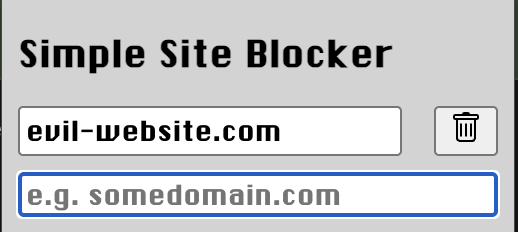

# Simple Site Blocker

A simple, free web extension that blocks websites by domain to help keep you focused. Currently supports only Chrome 84+.

## Install

#### 1. Download the repository

Linux/Mac:

    git clone https://github.com/mphiliposian/simple-site-blocker.git ~/simple-site-blocker

Windows:

    git clone https://github.com/mphiliposian/simple-site-blocker.git %USERPROFILE%\simple-site-blocker

#### 2. Add to Chrome

- Open Chrome
- Click the extensions icon to open the extensions popup menu
- Click "Manage Extensions" to navigate to the extensions page
- Turn on "Developer mode" using the toggle in the upper-right corner
- Click the "Load unpacked" button
- Find and select the simple-site-blocker folder

After that, Simple Site Blocker should be available in the extensions popup menu. You can click the pin icon for convenient access.

## Uninstall

#### 1. Remove from Chrome

In the extensions popup, click the ... icon next to Simple Site Blocker and then click "Remove Extension".

#### 2. Delete the Repository

Linux/Mac:

    rm -rf ~/simple-site-blocker

Windows:

    rmdir /s /q "%USERPROFILE%\simple-site-blocker"

If that fails, you can always just move the folder to the trash / recycle bin using your file explorer.

# Roadmap

P0 (Highest Priority):

- Pause blocking for a specified time or until resumed
- Configurable redirects instead of hard blocking
- UX improvements (e.g. no incomplete domains, to avoid confusing behavior like "r" blocking _all_ domains beginning with "r")

P1:

- Support for Edge, Safari, Firefox
